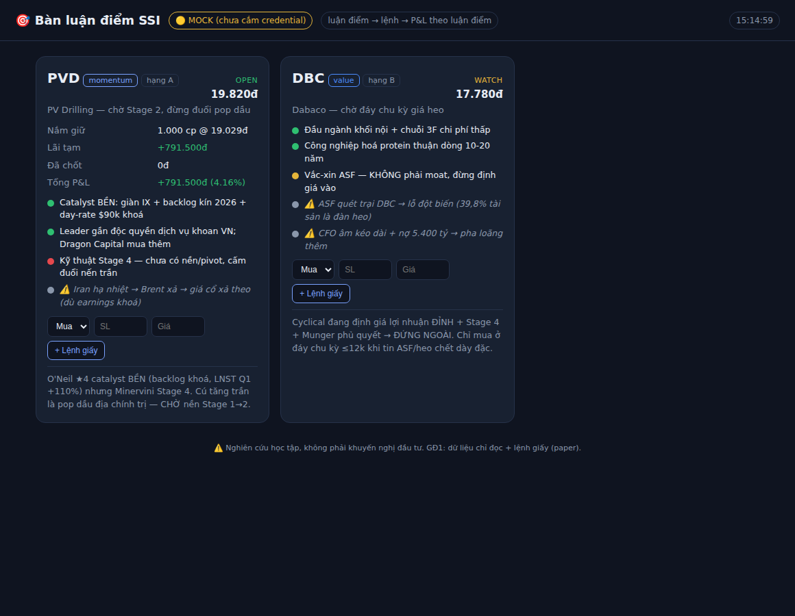

# 🎯 SSI Thesis Trading — bàn luận điểm

Web app đóng **vòng lặp đầu tư**: `luận điểm → lệnh → P&L THEO TỪNG LUẬN ĐIỂM`. Nối các
luận điểm từ framework (`/hoi-dong-dau-tu`, `/hoi-dong-luot-song`…) với dữ liệu & giao
dịch thật qua **SSI FastConnect** (`ssi-sdk`), để biết luận điểm nào *thực sự* kiếm tiền.



## Chạy nhanh (chế độ MOCK — không cần credential)
```bash
cd ssi-trading-app
pip install -r requirements.txt
python -m scripts.seed              # nạp 2 luận điểm mẫu (DBC, PVD) + 1 lệnh giấy
uvicorn app.main:app --reload       # mở http://127.0.0.1:8000
```
Không có credential → app chạy **MOCK**: giá giả có nhịp, lệnh **giấy (paper)**, P&L theo
luận điểm tính đầy đủ. An toàn tuyệt đối để phát triển.

## Lên LIVE (dữ liệu thật SSI)
Sao chép `.env.example` → `.env`, điền `SSI_CLIENT_ID / API_KEY / API_SECRET`. App tự
chuyển sang lấy giá thật qua `ssi-sdk`. Đặt lệnh **THẬT** vẫn TẮT cho tới khi bật rõ ràng
`SSI_TRADING_ENABLED=1` + có `SSI_PRIVATE_KEY` (ký RS256) + `SSI_ACCOUNT_NO`.

## Hai giai đoạn (an toàn trước, tiền thật sau)
- **GĐ1 (hiện tại):** FC Data (chỉ đọc) + **paper trading** + P&L/luận điểm + cảnh báo mốc giá.
- **GĐ2:** bật đặt lệnh thật (`place_limit_order`…), đồng bộ vị thế/số dư (`get_equity_*`),
  realtime qua WebSocket (`subscribe_symbol_quote`, `subscribe_order_status`). Đã chừa chỗ.

## Kiến trúc
```
app/
├── config.py    # nạp env → quyết định MOCK/LIVE; trading thật mặc định TẮT
├── models.py    # SQLModel: Thesis · Pillar (trụ + điều kiện vô hiệu) · Level (mốc giá) · Trade
├── market.py    # giá: LIVE qua ssi-sdk get_ohlc_1day, fallback MOCK
├── engine.py    # VỊ THẾ + P&L theo luận điểm (Decimal, giá vốn bình quân) + cảnh báo mốc
├── db.py        # SQLite
├── importer.py  # parse luận điểm markdown (format /theo-doi-luan-diem) → Thesis+Pillar+Level
├── stream.py    # realtime: vòng tick 2s đẩy giá + cảnh báo mốc qua WebSocket (re-arm 1,5%)
└── main.py      # FastAPI REST + WS /ws + phục vụ dashboard
frontend/index.html   # dashboard 1 trang (theme-aware): thẻ luận điểm, P&L live, đổi trạng thái trụ, thêm lệnh giấy
scripts/seed.py       # nạp DBC + PVD từ phân tích thật
```

## Import luận điểm từ framework (đóng vòng chat → app)
Nút **📥 Import luận điểm** trên dashboard (hoặc API):
```
GET  /api/import/scan                    # liệt kê file trong stock-analysis/reports/theses/
POST /api/import/file/DBC.md?dry_run=true    # preview — KHÔNG ghi DB (mặc định)
POST /api/import/file/DBC.md?dry_run=false   # ghi thật (chặn 409 nếu mã đã có luận điểm mở)
POST /api/import/markdown                # dán markdown trực tiếp {markdown, symbol_hint, dry_run}
```
Parser đọc đúng format do skill `/theo-doi-luan-diem` sinh: trụ cột 🟢🟡🔴⚪ + điều kiện
vô hiệu hoá + mốc giá (tích luỹ/mua hời/pivot/stop). Không chắc trường nào → bỏ trống,
không đoán bừa; luôn preview trước khi ghi.

## Sổ lệnh, R:R & hiệu suất
- **R:R trên thẻ luận điểm**: kế hoạch `(target−entry)/(entry−stop)` từ Levels + **R hiện tại**
  của vị thế mở `(giá−giá vốn)/(giá vốn−stop)` — biết đang lời/lỗ bao nhiêu "R" so rủi ro chấp nhận.
- **📒 Sổ lệnh** (`GET /api/trades`): mọi lệnh mới nhất trước; **ghi chú sửa được** ngay trên
  bảng (`PATCH /api/trades/{id}`) — nhật ký vì sao vào/ra, nguyên liệu để review kỷ luật.
- **Thống kê** (`GET /api/stats`): tổng P&L (chốt + tạm), phí, **win rate tính trên luận điểm
  đã có lãi/lỗ chốt** (không tô vẽ khi dữ liệu ít), gộp theo mode, xếp hạng từng luận điểm.

## Realtime (WebSocket `/ws`)
- Server tick ~2s (chỉ khi có client xem): đẩy `{type:"quote", prices:{sym:price}}` cho mọi
  mã đang có luận điểm mở — dashboard nhảy giá + P&L **tại chỗ**, không reload.
- Giá chạm mốc luận điểm (vùng mua/stop/pivot/target) → `{type:"alert", ...}`: toast +
  thẻ nháy vàng. Chống spam: mỗi mốc chỉ báo lại sau khi giá rời xa ≥1,5% (re-arm).
- MOCK và LIVE dùng chung đường ống; WS rớt tự reconnect (backoff), fallback poll 30s.

## Nguyên tắc
- **Tiền dùng `Decimal`** (no float) — nhất quán với `stock-analysis/tools`.
- **Trading thật là hành động không undo** → mặc định tắt, sau nút xác nhận + dry-run.
- Mọi màn hình kết thúc: *nghiên cứu học tập, không phải khuyến nghị đầu tư.*
